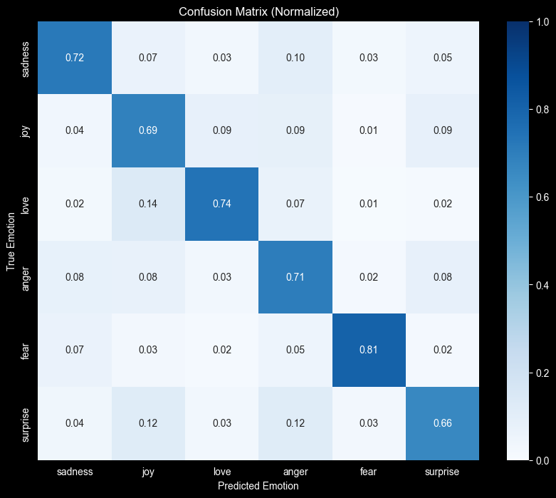

# 6 Emotions Text Classification Model

A logistic regression model for classifying text into 6 emotion categories.

## Model Description

- **Model type:** Logistic Regression with TF-IDF features
- **Language:** English
- **Task:** Multi-class text classification
- **Labels:** anger, fear, joy, love, sadness, surprise

## Training Data

This model was trained on a merged dataset from two sources:

1. **GoEmotions** (Google): A corpus of 58k Reddit comments with 27 emotion categories
   - Source: [Kaggle](https://www.kaggle.com/datasets/shivamb/go-emotions-google-emotions-dataset)
   - Paper: [arXiv:2005.00547](https://arxiv.org/abs/2005.00547)

2. **Emotion Dataset**: Text samples labeled with basic emotions
   - Source: [Kaggle](https://www.kaggle.com/datasets/parulpandey/emotion-dataset/data)
   - Paper: [EMNLP 2018](https://www.aclweb.org/anthology/D18-1404)

Labels were mapped to 6 core emotion categories for this model.

## Features

The model uses a combination of:
- **Word-level TF-IDF:** unigrams to trigrams (max 20,000 features)
- **Character-level TF-IDF:** 3-5 character n-grams (max 15,000 features)

## Training

- **Framework:** scikit-learn
- **Hyperparameter tuning:** GridSearchCV with 3-fold cross-validation
- **Class balancing:** `class_weight='balanced'`

## Performance

### Model Metrics
- **Cross-Validation Accuracy:** 0.7163
- **Test Accuracy:** 0.70
- **Training Size:** 41,974
- **Test Size:** 6,067

### Confusion Matrix


## Limitations
- Trained on English text; performance on other languages is not guaranteed.
- May not generalize well to formal and technical texts.
- Single-label classification (no multi-emotion detection).
- Potential biases from training data sources.

## Usage

```python
import skops.io as sio

# Load model (review untrusted types before loading)
trusted_types = [
    "sklearn.pipeline.Pipeline",
    "sklearn.linear_model._logistic.LogisticRegression",
    "sklearn.feature_extraction.text.TfidfVectorizer",
    "numpy.ndarray",
    "numpy.dtype"
]

model = sio.load("6emotions_model.skops", trusted=trusted_types)

# Predict
text = "I'm so happy today!"
prediction = model.predict([text])
print(prediction)  # ['joy']
