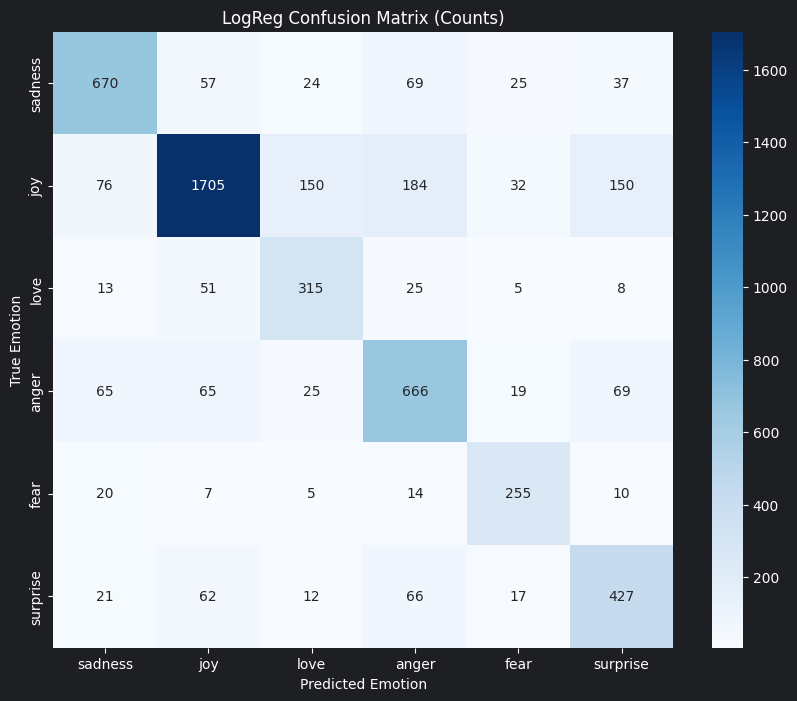
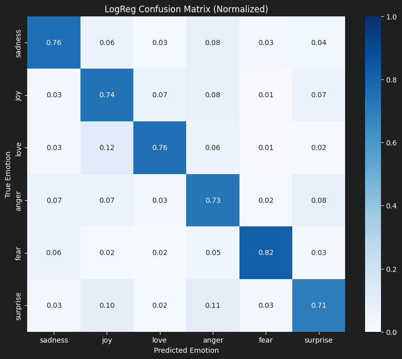

# LogReg emotion classifier

A logistic regression model for classifying text into 6 emotion categories.

## Model Description

- **Model type:** Logistic Regression with TF-IDF features
- **Language:** English
- **Task:** Multi-class text classification
- **Labels:** anger, fear, joy, love, sadness, surprise

## Training Data

This model was trained on a merged dataset from two sources:

1. **GoEmotions** (Google): A corpus of 58k Reddit comments with 27 emotion categories
   - Source: [Kaggle](https://www.kaggle.com/datasets/shivamb/go-emotions-google-emotions-dataset)
   - Paper: [arXiv:2005.00547](https://arxiv.org/abs/2005.00547)

2. **Emotion Dataset**: Text samples labeled with basic emotions
   - Source: [Kaggle](https://www.kaggle.com/datasets/parulpandey/emotion-dataset/data)
   - Paper: [EMNLP 2018](https://www.aclweb.org/anthology/D18-1404)

Labels were mapped to 6 core emotion categories for this model.

## Features

The model uses a combination of:
- **Word-level TF-IDF:** unigrams to trigrams (max 20,000 features)
- **Character-level TF-IDF:** 3-5 character n-grams (max 15,000 features)

## Training

- **Framework:** scikit-learn
- **Regularization:** `C=1.0` (fixed)
- **Class balancing:** `class_weight='balanced'`

Run [train.ipynb](train.ipynb) after installing the repository's root `requirements.txt`. The notebook uses the shared data preparation and features, trains once on the full training set, and evaluates on the held-out test set. It saves the classifier to `artifacts/` and writes metrics plus count and normalized confusion matrices to `results/`. Start Jupyter from the repository root or this model folder.

## Performance

### Model Metrics
- **Test Accuracy:** 0.7449
- **Training Size:** 39,718
- **Test Size:** 5,421

These results use the cleaned single-label split: each test text is unique, and no test text appears in training.

### Confusion Matrix
Rows show true emotions and columns show predictions.

**Prediction counts**



**Row normalized**



## Limitations
- Trained on English text; performance on other languages is not guaranteed.
- May not generalize well to formal and technical texts.
- Single-label classification (no multi-emotion detection).
- Potential biases from training data sources.

## Usage

```python
import skops.io as sio

# Load model (review untrusted types before loading)
trusted_types = [
    "sklearn.pipeline.Pipeline",
    "sklearn.linear_model._logistic.LogisticRegression",
    "sklearn.feature_extraction.text.TfidfVectorizer",
    "sklearn.pipeline.FeatureUnion",
    "numpy.ndarray",
    "numpy.dtype"
]

model = sio.load("models/logreg/artifacts/6emotions_model.skops", trusted=trusted_types)

# Predict
text = "I'm so happy today!"
prediction = model.predict([text])
print(prediction)  # ['joy']
```
