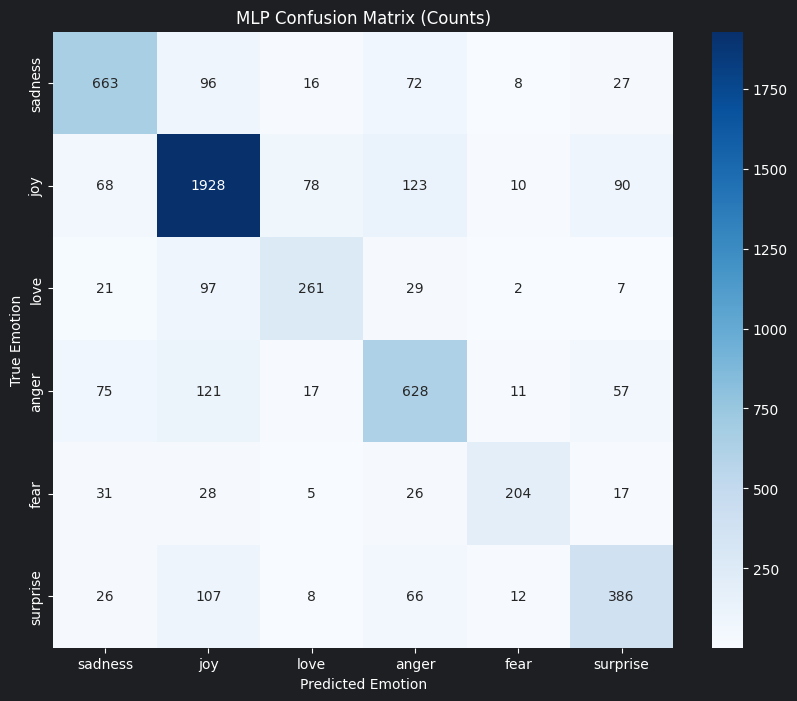
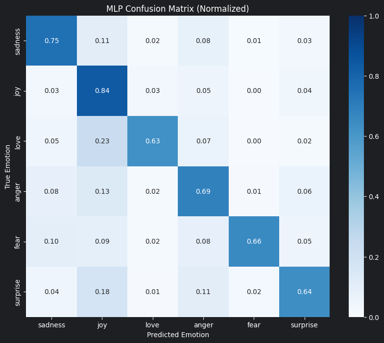

# MLP emotion classifier

This model classifies English text as sadness, joy, love, anger, fear, or surprise. It uses the same word and character TF-IDF features and shared data loader as LogReg.

Run [train.ipynb](train.ipynb) from the repository root or this folder after installing the root `requirements.txt`. The notebook trains one fixed MLP on the full training set and evaluates it once on the held-out test set. It uses one hidden layer of 64 ReLU units, `alpha=1e-4`, Adam, batch size 256, no class weighting, and early stopping on 10% of the training rows. The training set caps `joy` at 14,000 examples (41,718 rows), not 12,000 as in the other models.

| Metric | Value |
| --- | ---: |
| Test accuracy | 0.7508 |
| Test macro F1 | 0.7142 |
| Training / test rows | 41,718 / 5,421 |

The MLP pipeline is saved locally to Git-ignored `artifacts/6emotions_model.skops`. The `results/` folder contains the training summary, classification report, and these plots:

**Prediction counts**

**Row normalized**

Rows show true emotions and columns show predictions. The count matrix shows the number of examples in each cell; the normalized matrix shows the share within each true emotion.
